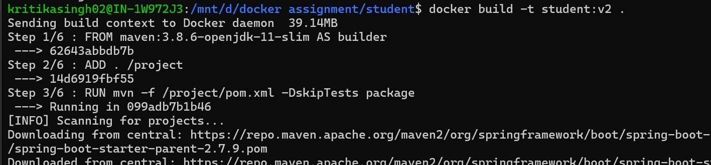
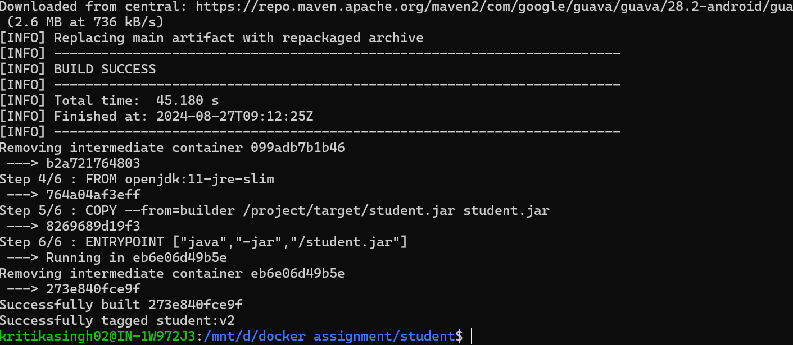
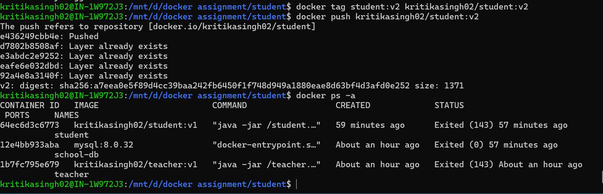
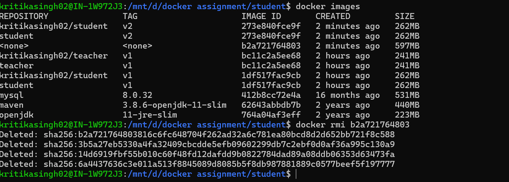
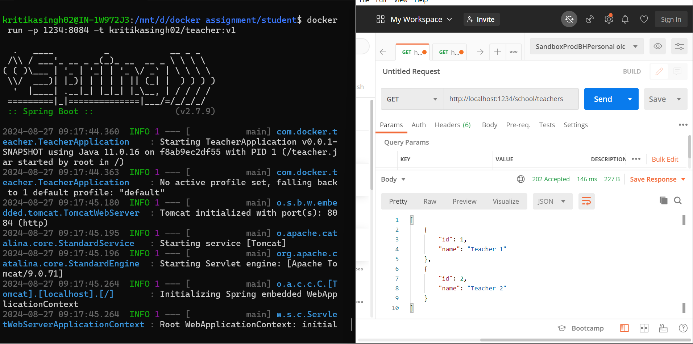
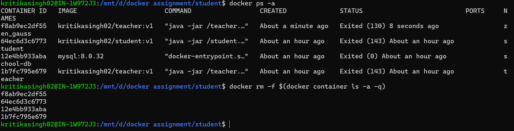
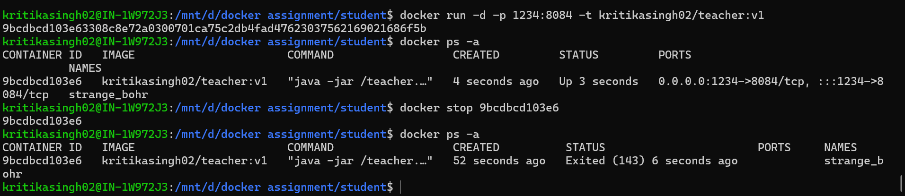
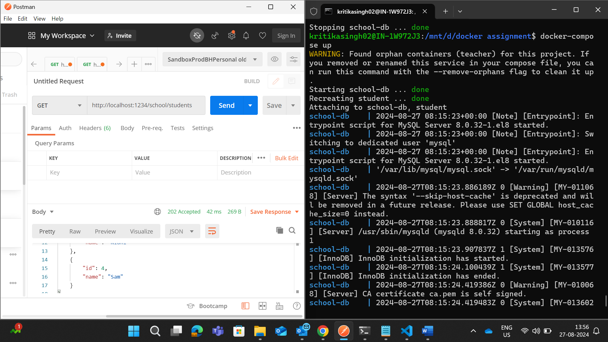

# Docker Practice

## Description
Created two services:
1. Student - 
     - This service display list of students.
     - This service use MySQL database to get data.
     - Rest API endpoint - http://localhost:8082/school/students
2. Teacher 
     - This service display list of teachers.
     - This service doesn't user database to get data.
     - Rest API endpoint - http://localhost:8084/school/teachers

## Tech Stack

1. Java
2. Springboot
3. Docker
4. Docker compose
5. MySQL

## Project SetUp
1. clone git project - git clone https://github.com/kritika-singh-sengar/docker-practice.git
2. Build Docker image:
   1. Open terminal: cd student
      > docker build -t student:v1 .
   2. Open terminal: cd teacher
      > docker build -t teacher:v1 .
3. Tag Docker image:
   > docker tag student:v1 kritikasingh02/student:v1
   > docker tag teacher:v1 kritikasingh02/teacher:v1
4. Push Docker image to docker Hub:
   > docker login --username kritikasingh02
   > docker push kritikasingh02/student:v1
   > docker push kritikasingh02/teacher:v1
5. List of Images: 
   > docker images
6. Remove Docker Image:
   > docker rmi image_id
7. List of Containers:
   > docker ps -a

## Run Project
### 1. Run on Docker:
* Open command prompt and run following cmds:
  - cd teacher
  - docker docker run -p 1234:8084 -t kritikasingh02/teacher:v1
* Open postman:
  - Get API: http://localhot:1234/school/teachers

### 2. Run with Docker compose:
* Open command prompt and run following cmds:
  - open terminal in main project directory where docker-compose.yml file is present
  - docker-compose up
* Open postman:
  - Get API for student: http://localhot:1234/school/teachers
  - Get API for teacher: http://localhot:1235/school/students

## Images:

1. Docker Image Build:
   
   

2. Docker Image Tag and Push:
  

3. Image Commands:
   
   

4. Container Commands:
   
   

5. Docker Compose:
   
